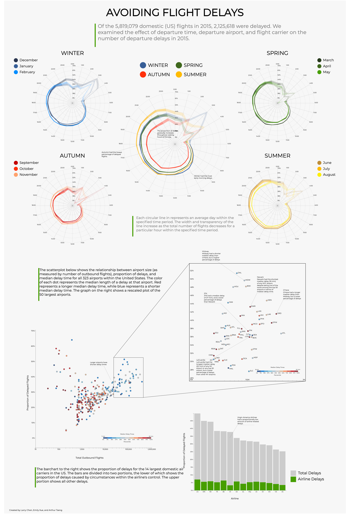

This data visualization was created for the Data Visualization course offered at the University of Chicago (CMSC 23900). Its purpose is to help others find out how to avoid flight delays on US outbound flights, and to understand the patterns we found in the flight delay data we analyzed [here](https://www.kaggle.com/usdot/flight-delays), from the US Department of Transportation. 

The project can be found [here](https://github.com/ekxue/flight-visualization) (forked from the original repository in my group member's Github). We used `d3.js` to create the visualizations.

