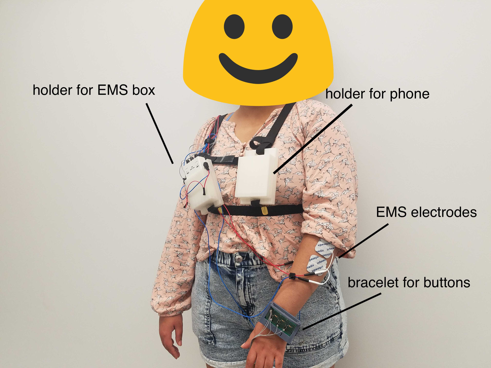
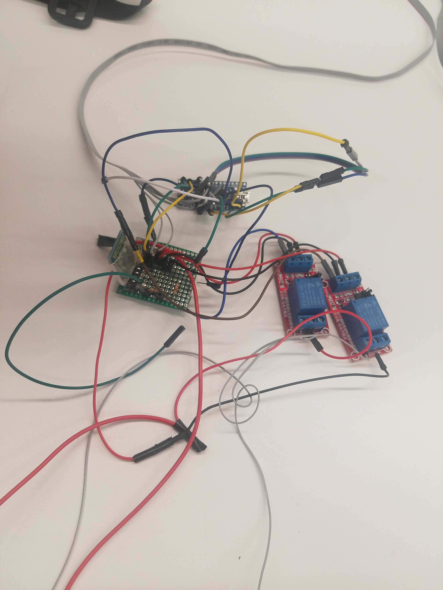
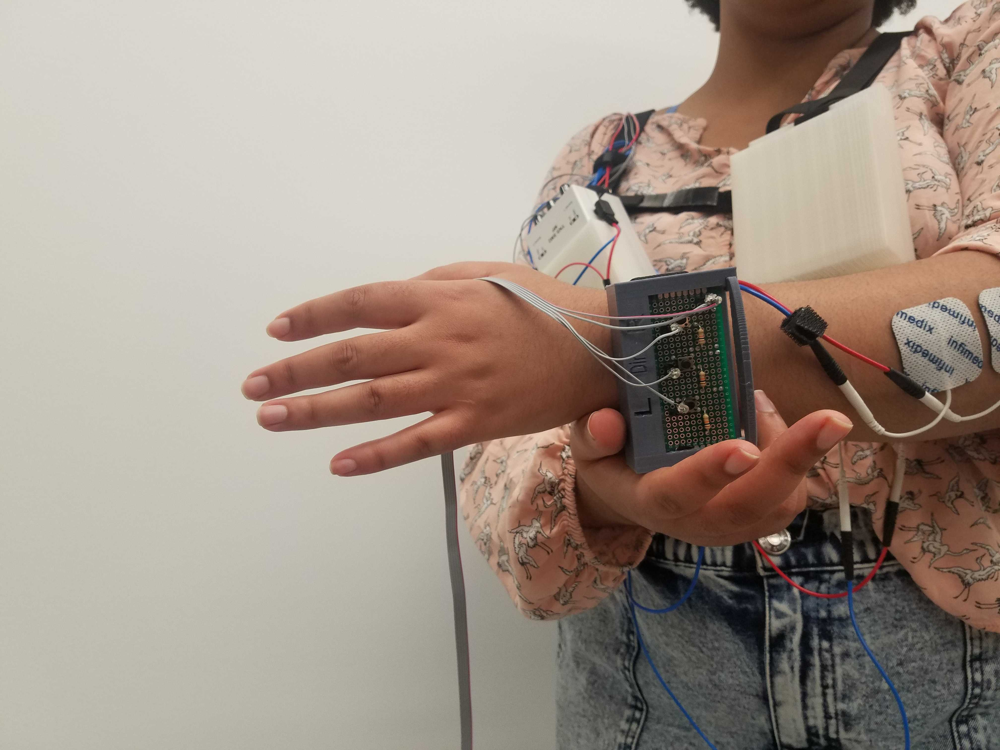

For the first HCI (Human Computer Interaction) course offered at the University of Chicago (CMSC 23220), my teammates and I created Human Compass, a wearable device that assists the user in navigating to any destination. 

To use the compass:
* Enter your destination GPS coordinates on your phone. These are sent to the Arduino over bluetooth.
* After calibrating the EMS device to your liking, press the central button on the bracelet. Using [EMS](https://en.wikipedia.org/wiki/Electrical_muscle_stimulation) electrode pads, the Human Compass device will move your hand to the left if you need to walk left, and right if you need to walk right.
* As you continue along your route, you can press the button whenever you need directions and the EMS nodes will move your hand to point you in the right direction.

For this project, we created the navigation program using `C++` on an Arduino, and we assembled the entire device ourselves, from soldering the actuators and sensors together, to using `TinkerCAD` to model the different pieces and print them out with a 3D printer. 

*The full Human Compass device when worn*

*One of the circuitboards that we designed and soldered. It connects the arduino, bluetooth device, and EMS electrode boxes*

*The bracelet with the button that allows you to request directions from the Human Compass. It also has an L and R button, for calibration purposes (for adjusting the strength of the EMS electrode to your liking, so that it doesn't pull your hand too hard or too softly)*

